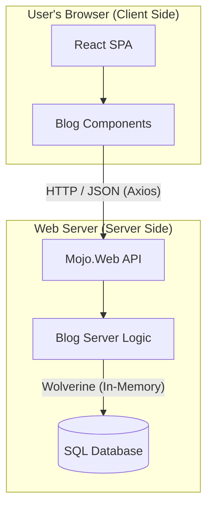

# MojoPortal Reborn (.NET 10)
**Architecture Reference & Implementation Plan**

---

## 1. Executive Summary

This project is a "Greenfield on Brownfield" modernization of the legacy MojoPortal CMS. The goal is to rewrite the system using **.NET 10**, **React 19**, and **Vertical Slice Architecture**, while migrating data from the legacy MSSQL database.

The system moves away from the traditional N-Tier layered architecture (UI → Business → Data) to a **Modular Monolith** where features are self-contained on the backend, and the UI is decoupled as a separate Single Page Application (SPA).

---

## 2. High-Level Architecture

The solution relies on a **Headless API** architecture. The backend serves data via JSON endpoints, and the frontend is a pure React application.

### The Logical Flow

- **The Host (Mojo.Web)**: The API entry point. It runs on the server, holds the Database connections, and executes business logic via Wolverine.
- **The Client (Mojo.Frontend)**: The React SPA. It runs in the browser and talks to the Host via HTTP APIs (Axios).
- **The Modules**: Distinct business domains (Blog, Forum, Core) that contain their own Server-Side Logic.

### Architecture Diagram (Mermaid)



---

## 3. Technical Stack & Key Decisions

| Component   | Technology               | Justification |
|-------------|--------------------------|---------------|
| Framework   | .NET 10 (Preview)        | Learning the bleeding edge. |
| UI Framework| React 19                 | Modern, component-based UI ecosystem. |
| Messaging   | Wolverine                | Handles In-Process routing, API generation, and Transactional Outbox patterns. |
| Data Access | EF Core                  | Modern ORM. Replaces Stored Procedures with LINQ. |
| Database    | SQL Server               | Legacy compatibility. Single DB, but separated by Schemas (e.g., blog.Posts). |
| Validation  | FluentValidation         | Separates validation rules from business logic. |
| HTTP Client | Axios                    | Standard promise-based HTTP client for the browser. |

---

## 4. Solution Structure

```
/MojoReborn.sln
│
├── /src
│   ├── /Mojo.Web                   # ASP.NET Core Web API Project
│   │   ├── Program.cs              # Registers Wolverine, Modules, DB
│   │   └── /Properties             # Launch settings
│   │
│   ├── /Mojo.Frontend              # React SPA Project (Vite)
│   │   ├── /src
│   │   │   ├── /api                # Axios clients
│   │   │   ├── /components         # Shared UI Components
│   │   │   └── /features           # Feature-specific UI (Blog, Forum)
│   │   └── package.json
│   │
│   ├── /Mojo.Shared                # The "Glue" (Referenced by backend modules)
│   │   ├── /Contracts              # Shared Interfaces (if any)
│   │   └── /DTOs                   # Data Transfer Objects
│   │
│   └── /Modules                    # The Business Domains (Backend)
│       │
│       ├── /Mojo.Modules.Core      # Identity, Users, Site Settings
│       │
│       └── /Mojo.Modules.Blog      # Example Feature Module
│           ├── BlogDbContext.cs       # Module-specific DB Context
│           └── /Features
│               └── /CreatePost        # The Vertical Slice
│                   ├── CreatePostCommand.cs  # The Input
│                   ├── CreatePostHandler.cs  # The Logic (Wolverine)
│                   └── CreatePostEndpoint.cs # The API Route
```

---

## 5. Deep Dive: The Vertical Slice

In this architecture, a "Feature" is a self-contained folder. You do not jump between a "Controllers" folder and a "Services" folder.

### Example Slice: CreatePost

#### A. The Contract (Located in Mojo.Shared)

**File: CreatePostCommand.cs**  
**Purpose:** A simple class (Record) holding the data needed to create a post (Title, Body, AuthorId).

#### B. The UI (Located in Mojo.Frontend)

**File: CreatePostForm.tsx**  
**Purpose:** The visual form.  
**Behavior:** Captures input state and calls `blog.api.ts` to send a POST request.

#### C. The API Definition (Located in Mojo.Modules.Blog)

**File: CreatePostEndpoint.cs**  
**Purpose:** Uses Wolverine attributes to expose an HTTP route (e.g., `POST /api/blog/posts`).  
**Behavior:** Receives the HTTP request and immediately passes the command to the Bus.

#### D. The Logic (Located in Mojo.Modules.Blog)

**File: CreatePostHandler.cs**  
**Purpose:** The "Brain".  
**Dependencies:** Injects `BlogDbContext`.  
**Behavior:**
1. Receives `CreatePostCommand`.
2. Validates logic.
3. Adds Entity to `BlogDbContext`.
4. Saves changes.
5. (Optional) Returns a `PostCreated` event for the Outbox.

---

## 6. Implementation Strategy (Step-by-Step)

### Phase 1: The Foundation (Weekend 1)

- **Data Setup:** Run legacy MojoPortal locally to generate a populated MSSQL database.
- **Scaffold:** Create the Solution structure (Web API, Frontend, Shared).
- **Reverse Engineer:** Create a temporary project to run `dotnet ef dbcontext scaffold` against the legacy DB.
- **Clean Up:** Move the generated Entities into the Mojo.Modules.* projects.

### Phase 2: The "Walking Skeleton" (Weekend 2)

- **Wiring:** Configure Wolverine and EF Core in `Mojo.Web/Program.cs`.
- **First Slice:** Implement "Get Blog Posts" (Read-Only).
  - Create the Query DTO.
  - Create the Handler (Backend).
  - Create the Endpoint (Backend).
  - Create the React Component (Frontend).
- **Verification:** Ensure the list loads via API call.

### Phase 3: The Migration (Deep Work)

- **Identity:** Set up ASP.NET Core Identity tables. Write a SQL script to migrate users from `mp_Users` to `AspNetUsers`.
- **Password Compat:** Implement a custom `IPasswordHasher` that detects legacy MojoPortal hashes and upgrades them on successful login.

### Phase 4: Features

- Pick features one by one (Blog, Forums, HTML Content).
- Rewrite them using the Vertical Slice pattern.
- Do not port code directly. Read the old code to understand what it did, then write new code to do it the Wolverine way.

---

## 7. Appendix & Notes

- **Schema Strategy:** Keep a single SQL Server instance but use schemas to separate module data (e.g., `blog.Posts`, `forum.Threads`).
- **Outbox Events:** Use Wolverine's transactional outbox pattern to reliably publish domain events after DB commits.
- **Testing:** Create integration tests that run against an in-memory or ephemeral SQL instance for each module.
- **Observability:** Add structured logging and distributed tracing early (Wolverine supports integrations).
- **Backward Compatibility:** Implement compatibility layers for legacy stored procedures and hashing where migrating behavior is non-trivial.

---

## End of Document